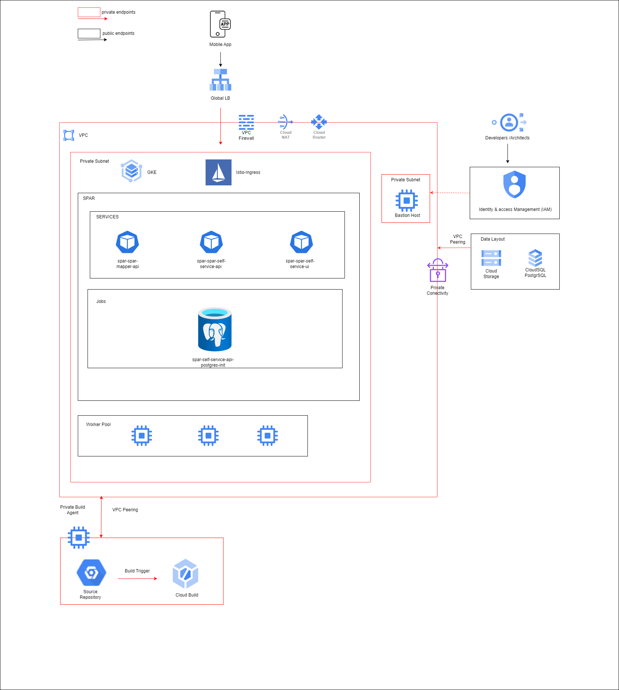

# SPAR, one-click deployment on GCP



## Introduction

### Overview

- **Kubernetes (GKE)** - Google Kubernetes Engine (GKE) is used as the core platform for container orchestration.

-	**spar-spar-mapper-api** - Manages the routing and mapping of service requests to appropriate internal services.

- **spar-spar-self-service-api** - Enables self-service functionalities by handling user requests and interactions with internal services.

- **spar-spar-self-service-ui** – Provides the user interface for the self-service API, allowing users to interact with the system

- **Istio Ingress**: The traffic to the Spar services is managed by Istio, which acts as the ingress controller.

- **Gateway**: The gateway in Istio acts as the entry point for external traffic.

- **Virtualservice**: A virtual service defines specific routing rules and directs the traffic to the desired Kubernetes services

## Deployment Approach

Deployment uses the following tools:

- **Terraform for GCP** - Infrastructure deployment
- **Helm chart** - Application/Microservices deployment
- **Cloud Build** - YAML scripts which acts as a wrapper around Terraform Deployment scripts

The entire Terraform deployment is divided into 2 stages -

- **Pre-Config** stage
  - Create the required infra for RC deployment
- **Setup** Stage
  - Deploy the Core RC services

- **Helm Chart Details**

| Chart                   | Chart Version                 |
|-------------------------|-------------------------------|
| spar                    | spar-1.0.0                    |
| istiod                  | istiod-1.23.2                 |
| istio-ingressgateway    | gateway-1.23.2                |
| istio-base              | base-1.23.2                   |
| cert-manager            | cert-manager-v1.16.1          |
| prometheus              | kube-prometheus-stack-65.2.0  |
  
### Pre-requisites

- #### [Install the gcloud CLI](https://cloud.google.com/sdk/docs/install)

- #### Alternate

  - #### [Run gcloud commands with Cloud Shell](https://cloud.google.com/shell/docs/run-gcloud-commands)
  
- **Install kubectl**

   https://cloud.google.com/kubernetes-engine/docs/how-to/cluster-access-for-kubectl#apt

  
- **Install Helm**

  https://helm.sh/docs/intro/install/


- **Esignet Cluster Setup**
 
  Esignet cluster must be set up and running before proceeding.


### Workspace - Folder structure

- **(***Root Folder***)**
  - **assets**
    - images
    - architecture diagrams
    - ...(more)
  - **builds**
    - **apps** - Deploy/Remove all Application services
    - **infra** - Deploy/Remove all Infrastructure components end to end
  - **deployments -** Store config files required for deployment
    - **configs**
      - Store config files required for deployment
    - **scripts**
      - Shell scripts required to deploy services
  - **terraform-scripts**
      - Deployment files for end to end Infrastructure deployment
  - **terraform-variables**
    - **dev**
      - **pre-config**
        - **pre-config.tfvars**
          - Actual values for the variable template defined in **variables.tf** to be passed to **pre-config.tf** 
      


## Step-by-Step guide

#### Setup CLI environment variables

```bash
PROJECT_ID=
OWNER=
GSA=$PROJECT_ID-sa@$PROJECT_ID.iam.gserviceaccount.com
GSA_DISPLAY_NAME=$PROJECT_ID-sa
REGION=asia-south1
ZONE=asia-south1-a
CLUSTER=
DOMAIN_NAME=
EMAIL_ID=
alias k=kubectl
```

#### **Script to setup authentication, configuring the project, enabling services, and creating a service account in GCP**:
```
script file located at `deployment/scripts/setup_gcp.sh` 

**To execute the script**

bash setup_gcp.sh
```

#### Deploy Infrastructure using Terraform

#### Terraform State management

```bash
# Maintains the Terraform state for deployment

gcloud storage buckets create gs://$PROJECT_ID-tfs-stg --project=$PROJECT_ID --default-storage-class=STANDARD --location=$REGION --uniform-bucket-level-access

#### The PROJECT_ID needs to be updated in the command below.

# List all Storage buckets in the project to check the creation of the new one
gcloud storage buckets list --project=$PROJECT_ID
```

#### Pre-Config

##### Prepare Landing Zone

```bash
cd $BASEFOLDERPATH
#### The PROJECT_ID,GSA needs to be updated in the command below.
# One click of deployment of infrastructure

gcloud builds submit --config="./builds/infra/deploy-script.yaml" \
--project=$PROJECT_ID --substitutions=_PROJECT_ID_=$PROJECT_ID,\
_SERVICE_ACCOUNT_=$GSA,_LOG_BUCKET_=$PROJECT_ID-tfs-stg

# Remove/Destroy infrastructure
#### The PROJECT_ID,GSA needs to be updated in the command below.
/*
gcloud builds submit --config="./builds/infra/destroy-script.yaml" \
--project=$PROJECT_ID --substitutions=_PROJECT_ID_=$PROJECT_ID,\
_SERVICE_ACCOUNT_=$GSA,_LOG_BUCKET_=$PROJECT_ID-tfs-stg
*/
```

##### Output

...
Apply complete! Resources: 36 added, 0 changed, 0 destroyed.


_**Before moving to the next step, you need to create domain/subdomain and create a DNS `A` type record pointing to `lb_public_ip`**_


#### Deploy services


```bash
cd $BASEFOLDERPATH

# One click of deployment of services
#### The REGION,PROJECT_ID,GSA,EMAIL_ID,DOMAIN needs to be updated in the command below.

gcloud builds submit --config="./builds/apps/deploy-script.yaml" \
--region=$REGION --project=$PROJECT_ID --substitutions=_PROJECT_ID_=$PROJECT_ID,\
_REGION_="$REGION",_LOG_BUCKET_=$PROJECT_ID-tfs-stg,_EMAIL_ID_=$EMAIL_ID,_DOMAIN_=$DOMAIN,_SERVICE_ACCOUNT_=$GSA

# Remove/Destroy
#### The REGION,PROJECT_ID,GSA,EMAIL_ID,DOMAIN needs to be updated in the command below.

/*
gcloud builds submit --config="./builds/apps/destroy-script.yaml" \
--region=$REGION --project=$PROJECT_ID --substitutions=_PROJECT_ID_=$PROJECT_ID,\
_REGION_="$REGION",_LOG_BUCKET_=$PROJECT_ID-tfs-stg,_SERVICE_ACCOUNT_=$GSA
*/
```


#### Connect to the Cluster through bastion host

```bash
gcloud compute instances list
gcloud compute ssh spar-dev-ops-vm --zone=$ZONE
gcloud container clusters get-credentials spar-dev-cluster --project=$PROJECT_ID --region=$REGION

kubectl get nodes
kubectl get pods -n spar
kubectl get svc -n istio-system
```


### Steps to connect to Psql
- Run the below command in bastion host
- Install psql client
```bash
sudo apt-get update
sudo apt-get install postgresql-client -y
```
- Run below command to access psql password
```bash
gcloud secrets versions access latest --secret spar-dev
```
- Run below command to get private ip of sql
```bash
 gcloud sql instances describe spar-dev-pgsql --format=json  | jq -r ".ipAddresses[0].ipAddress"
```
- Connect to psql
```bash
psql "sslmode=require hostaddr=PRIVATE_IP user=USERNAME dbname=postgres"
```

### DEMO

- Once the esignet is up and running get the client_secret value by running the below command 
```bash
    kubectl get secrets keycloak-client-secrets -n esignet -o jsonpath="{.data.mosip_pms_client_secret}" | base64 --decode
```

- Modify `client_secret` environment variable with the above secret and save the changes in the `esignet-OIDC-flow-with-mock` environment.

- To create an OIDC Client, navigate to the `OIDC Client Mgmt` section and trigger the necessary APIs to create the OIDC client. This gives the clientId and new privateKey_jwk.
 
- Next, create a mock identity for testing the OIDC flow. Go to the Mock Identity System section and trigger the `Create Mock Identity` API. Get the `individual_id` which gets generated.

- get the `clientId` and `privateKey_jwk` from the environment variables.

- **TO INTEGRATE ESIGNET AND SPAR**

  - Install psql client
  ```bash
    sudo apt-get install postgresql-client -y
  ```
    
  - Before running the script get the  ClientID, privatejwk key, Redirect URI,  esignet Domain.
    Trigger the DBScript to integrate esignet and spar
    
    ```bash
       https://github.com/tejash-jl/spar-stack/blob/main/deployments/scripts/dbscript.sh
       bash dbscript.sh
    ```
  - If you encounter any `permission denied` error when running the script, run 
  ```chmod +x dbscript.sh```


